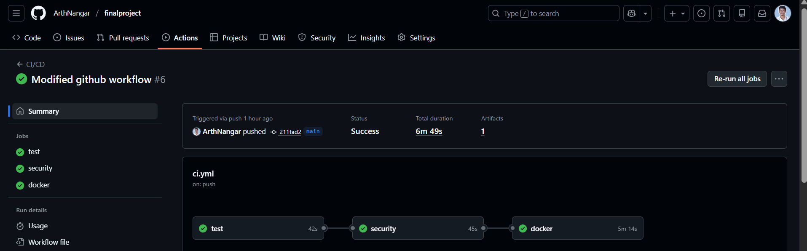
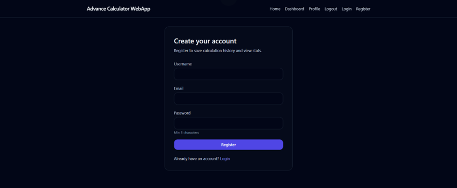
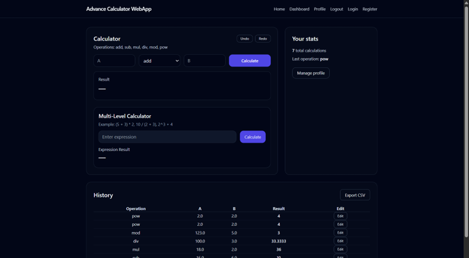
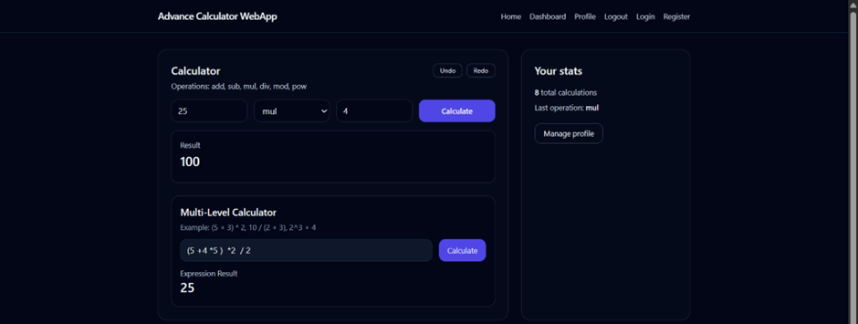

# Final Project – Advance Full Stack Calculator

Calculator is a full-stack, secure calculator web application implementing **complete BREAD functionality** (Browse, Read, Edit, Add, Delete) for user calculations.  
The project includes backend APIs, front-end pages, authentication, database persistence, automated testing, CI/CD pipelines, security scanning, and Docker-based deployment.

## Project Overview

This is the final project for IS601- Python for Web API, demonstrating complete full-stack calculator using FastAPI and modern DevOps practices:

- Complete BREAD Operations – Full CRUD-style workflow for user calculations.

- Secure Authentication – Session-based login with hashed passwords and protected routes

- Interactive Dashboard – Modern UI for performing calculations and managing history

- Advanced Calculator Features – Multi-operation support, expression evaluation, undo/redo, result formatting

- Persistent Storage – PostgreSQL database with SQLAlchemy ORM

- Comprehensive Testing – Unit, integration, and end-to-end (Playwright) test coverage

- Production-Ready CI/CD – Automated testing, security, and Docker Hub deployment via GitHub  Actions

## ✅ Features Implemented

### **BREAD Operations for Calculations**
- **Browse** – `/dashboard`  
  View all calculations created by the logged-in user  
- **Read** – `/calculations/{id}`  
  View details of a single calculation  
- **Add** – `/api/calculate`  
  Create a new calculation and auto-compute result  
- **Edit** – Edit calculation inputs via dashboard UI  
- **Delete** – Remove calculation from history  

### **Authentication & Security**
- User registration and login
- Secure password hashing (bcrypt)
- Session-based authentication
- User-specific data isolation


### **Calculator Features**
- Supported operations:
  - `add`, `sub`, `mul`, `div`, `mod`, `pow`
- Multi-level expression evaluation Eg: (5 * 4 ) - 3
- Undo / Redo functionality


### **Front-End Functionality**
- Calculator dashboard
- Edit calculation inputs
- View calculation history
- Export calculation history as CSV

### **CI/CD Pipeline**
- GitHub Actions
- Runs full test suite on every push
- Docker image build
- Pushes image to Docker Hub


## 📂 Project Structure
```
.
├── .github/
│   └── workflows/
│       └── ci.yml
│
├── app/
│   ├── core/
│   │   ├── __init__.py
│   │   ├── config.py
│   │   └── security.py
│   │
│   ├── db/
│   │   ├── base.py
│   │   ├── init_db.py
│   │   └── session.py
│   │
│   ├── models/
│   │   ├── __init__.py
│   │   ├── calculation.py
│   │   └── user.py
│   │
│   ├── routes/
│   │   ├── api.py
│   │   ├── auth.py
│   │   ├── deps.py
│   │   └── pages.py
│   │
│   ├── schemas/
│   │   ├── __init__.py
│   │   ├── calculation.py
│   │   └── user.py
│   │
│   ├── services/
│   │   ├── calculator.py
│   │   ├── calc_service.py
│   │   └── user_service.py
│   │
│   ├── __init__.py
│   └── main.py
│
├── static/
│   ├── css/
│   └── js/
│
├── templates/
│   ├── auth/
│   │   ├── login.html
│   │   └── register.html
│   │
│   ├── partials/
│   │   └── navbar.html
│   │
│   ├── layout.html
│   ├── index.html
│   ├── dashboard.html
│   └── profile.html
│
├── tests/
│   ├── unit/
│   ├── integration/
│   └── e2e/
│
├── docker-compose.yml
├── Dockerfile
├── pytest.ini
├── requirements.txt
├── README.md
├── LICENSE
└── .gitignore

```

## 🔗 API Endpoints

### **Authentication**
- `GET  /login` – Login page  
- `POST /auth/login` – Authenticate user  
- `GET  /register` – Registration page  
- `POST /auth/register` – Create new user  
- `POST /auth/logout` – Logout user  


## 🚀 Getting Started

### Prerequisites

- Python 3.10 or higher
- Docker Desktop
- Node.js 18+ (for Playwright)
- Git

### Installation

#### Option 1: Docker Setup

1. **Clone the repository**
   ```bash
   git clone https://github.com/ArthNangar/finalproject.git
   cd finalproject
   ```

2. **Start the application with Docker Compose**
   ```bash
   docker-compose up --build
   ```

3. **Access the application**
   ```bash 
     http://localhost:8000/

#### Local Setup

1. **Clone the repository**
   ```bash
   git clone  https://github.com/ArthNangar/finalproject.git
   cd finalproject
   ```

2. **Create and activate virtual environment**
   ```bash
   # Mac/Linux
   python3 -m venv venv
   source venv/bin/activate

   # Windows
   python -m venv venv
   venv\Scripts\activate
   ```

3. **Install Python dependencies**
   ```bash
   pip install -r requirements.txt
   ```
4. **Build Docker image:**
   ```bash
   docker compose build

   docker compose up

   Services:
   FastAPI backend → http://localhost:8000

   Stop:
   docker compose down --volumes


## 🧪 Automated Testing

- Unit tests (operations, utilities)
- Integration tests (models, schemas, dependencies)
- E2E API tests (auth + calculations)
- Test coverage included


## Screenshots

### ✅ GitHub Actions – Successful CI/CD Run


### Frontend Register Page


### Frontend Dashboard Page


### Calucalation part 



## 📜 License
This project is licensed under the MIT License.
See LICENSE for details.

## Acknowledgments
FastAPI Documentation

SQLAlchemy Docs

Docker Documentation

GitHub Actions Docs

PostgreSQL Docs

## 👨‍💻 Author
Arth Nangar

Master’s Student – Computer Science (NJIT)

Final Term project for course IS601 

Date : 12/15/2025